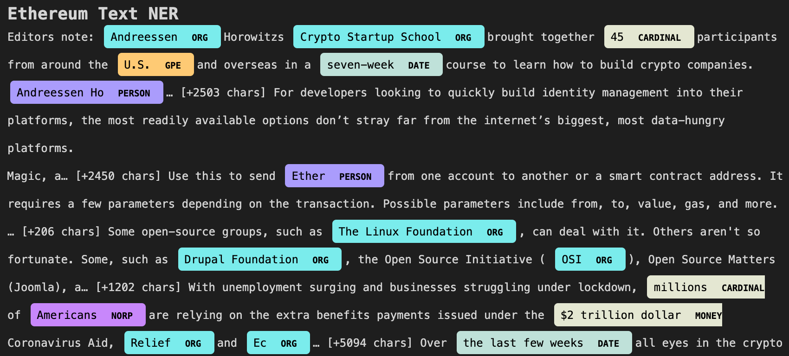

# nlp_homework
# Bitcoin & Ethereum News Analysis

In this analysis NLP (natural language processing) has been used to assess key words and word sentiment of articles on Bitcoin (BTC) and Ethereum (ETH) cryptocurrencies. To do this analysis, news data and articles were pulled from the most recent 30 days usin newsapi.

The first process was sentiment analysis, which invloved assessing text and breaking up positive, negative, compound and neutral text sentiment.
After doing a sentiment analysis, the answers to the following were deteremined. 

Q: Which coin had the highest mean positive score?

A: Ethereum has the highest mean positive score of 0.081, but Bitcoin was really close for positive sentiment mean at 0.075.

Q: Which coin had the highest compound score?

A: Both coins had a max compound score of 0.92.

Q. Which coin had the highest positive score?

A: Both coins had a max positive score of 0.34.

After doing a sentiment analysis, text was broken down for further analysis. Using ngrams, the most frequently occuring words could be found to shown patterns and highly associated words with both BTC and ETH.
THe following word clouds show the words associated with each coin in the news articles analyzed.

## BITCOIN WORD CLOUD
### Words associated and common to bitcoin news.
It shows common words associated with bitcion include, market, blockchain, satoshi and more. 'Bitcoin' was the most frequently occuring (57 times) followed by 'char' and 'btc'.

## ETHEREUM WORD CLOUD
### Words associated and common to ethereum news.
It shows words associated with ethereum include: major resistance, ahead, crypto and others. 'Ethereum' was the most frequently occuring (42 times), followed by 'level' and 'day'.

Finally, in the text analysis a NER (named entity recognition) process was used. This involved looking for key words and identifiers and then labeling them with an association of the type of entity. For instance 'J.K. Rowling' would be recognized as a name entity and 'Yesterday' would be recognized as a date entity. Samples of the outputs can be seen below for BTC and ETH article text pulled from newsapi.

These text analysis results and analysis code could be useful for building various machine learning and other data analysis models based on news and headlines regarding Bitcion and Ethereum topics. 
